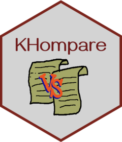

---
output:
  md_document:
    variant: gfm
html_preview: false
---

```{r, include = FALSE}
knitr::opts_chunk$set(
  collapse = TRUE,
  comment = "#>",
  fig.path = "man/figures/README-",
  out.width = "100%"
)
``` 

```{r echo=FALSE, results="hide", message=FALSE}
library("badger")
```

```{r, echo = FALSE, results='asis'}
cat(
  badge_github_actions("helseprofil/KHompare"),
  badge_codecov("helseprofil/KHompare"),
  badge_lifecycle("experimental", "orange"),
  badge_devel("helseprofil/KHompare", "blue")
)
```

# KHompare 

Compare KHelse cube dataset to check for any abnormal changes.

# Installation

It's advisable to **restart** your R session before installing the package:

```r
.rs.restartR() #restart RStudio
source("https://raw.githubusercontent.com/helseprofil/misc/main/utils.R")
kh_install(KHompare)

# load package
library(KHompare)
```

or the general method with:

```r
if(!requireNamespace("remotes")) install.packages("remotes")
remotes::install_github("helseprofil/KHompare")
```

# Main functions

Three main functions for this package are:

- `check_cube()` or `cc()` to find outliers
- `view_outliers()` or `vo()` to view outliers
- `plot_cube()` or `pc()` to plot outliers with time-series for geo code 

Use `help()` or `?` to read description of these functions eg.
`help(check_cube)` or read guide in [Usage](#usage) below.

# Usage{#usage}

To check a cube file for *TRIVSEL_3* with `check_cube()` function. If there are
more than one files that contain the word *TRIVSEL_3*, a more specific name should
be given. You can also specify which year folder to use ie. `KHxxxxNESTAR`,
where `xxxx` is the year.

```r
library("KHompare")
dt <- check_cube("TRIVSEL_3") #this will use the current year as in options("kh.year")
# OR
dt <- check_cube("TRIVSEL_3", year = 2021, type = "NH")

# to see the data
dt
```

By default `check_cube()` excludes all small municipalities. To include them then use argument `km = TRUE`.

```r
dt <- check_cube("TRIVSEL_3", km = TRUE)
```

To view the outliers eg. for `RATE` measurement value:

```r
view_outliers(dt, "RATE")
view_outliers(dt, var = "RATE", geo.levels = c("F", "K")) #Select only Fylke and big Kommune
```

You can use shortcut functions `cc()` or `vo()` for `check_cube()` and
`view_outliers()` respectively.

Comparison will be made on the measurement variables created by `LagKUBE()`
function in **KHfunction** such as:

- MEIS
- RATE
- TELLER
- SMR
- etc ..

New columns comparing the change of these measurement variables will be created
when running the function `check_cube()` and they are:

- *xxx*_NUM
- *xxx*_PCT
- *xxx*_NUM_OUT
- *xxx*_PCT_OUT

The *xxx* is the name of the measurement variables that are checked for the
difference in change numerically and percent. They are denoted by **\_NUM** and
**\_PCT** respectively. The column **\_OUT** indicates the measurement variables
that are of extreme values ie. outliers. The value for outliers are either **1**
for *lower* or **2** for *upper* outliers.

# Plot 

To plot with trend for a specific geographical code:

```r
plot_cube(dt, geo = 3, var = "TELLER")

#or
pc(dt, 3, "TELLER")

```


# Options

Global options can be found here [helseprofil/config](https://github.com/helseprofil/config/blob/main/config-khompare.yml)

# What is happening?

When running `check_cube("TRIVSEL_3")` function, these processes will be executed:

1. Find the most recent filename that contains the word *TRIVSEL_3* based on the
   date (YYYY-MM-DD) attached to the filename eg. `TRIVSEL_3_2022-03-01.csv`, in
   the current [root
   folder](https://github.com/helseprofil/config/blob/main/config-khompare.yml#L12)
   of the selected
   [year](https://github.com/helseprofil/config/blob/main/config-khompare.yml#L3).
2. Find the most recent population reference file ie.
   `BigSmall-Kommuner-REF-xxxx.rds` (*xxxx* is the year) in the current root
   folder, if it doesn't exist create this file from the most recent population
   file ie. `BEFOLK_GK` or `BEFOLK_GK_NH`, found in the current root folder.
   This file will be used to identify big and small municipalities with
   threshold of 10,000 population.
3. Identify all columns that create different dimensions in the dataset as the
   base for comparison such as *SOES*, *TRINN*, *SVOMMEFERD* etc.
4. Compare the yearly changes of all existing measurement variables in the
   dataset ie.
   [kube.var](https://github.com/helseprofil/config/blob/main/config-khompare.yml#L23)
   in the config file. This is indicated with the variables **\_NUM** and
   **\_PCT**.
5. Identify if there are extreme changes ie. outliers, indicated by value 1 and
   2 representing lower and upper outliers. This can be found in columns that
   end with **\_OUT**. 

# Population file 

This refers to the file `BigSmall-Kommuner-REF-xxxx.rds` for selecting big and
small municipalities. The file will be created automatically if it doesn't exist
in the root directory. To replace the existing file then use:

```r
create_pop_ref(year = 2022, type = "KH", overwrite = TRUE)
```

Population file is created either from `BEFOLK_GK` or `BEFOLK_GK_NH` most recent
file. If another `.csv` file should be used other than these two, you have to
create population reference file prior running `check_cube()` by:

```r
create_pop_ref(name = "NewBEFOLK_file.csv", overwrite = TRUE)
```
